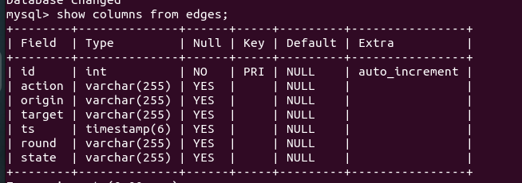

### This is a tool for pBFT consensus visualization, you can find the pBFT project here [pBFT](https://github.com/bianyuanop/pBFT)

### Color Scheme

| Action      | Color(Hex) |
| ----------- | ---------- |
| PrePrepare  | #000075    |
| Prepare     | #42d4f4    |
| Commit      | #dcbeff    |
| NewRound    | #e6194b    |
| RoundChange | #800000    |

| State          | Color(Hex) |
| -------------- | ---------- |
| Prepared       | #42d4f4    |
| Committed      | #dcbeff    |
| NewRound       | #808000    |
| RoundChange    | #800000    |
| FinalCommitted | #911eb4    |

### Mechanism

In the pBFT, for every node, on receiving messages, they will process messages then write the **action, origin id, target id, round number, phase, time stamp(ms)** into database. This tool will use the messages recorded in database to visualize the processing process of the whole system. **HOWEVER**, due to the record operations happen at the receivers' sides, so we can't know the senders' states at receivers' sides. Except that, the visualization tool works fine.

### Usage

Install dependencies

```
pip install -r requirements.txt
```

Create table in MySQL



Configure database credentials in `db.py`

Run 

```
python main.py <count:number> # count here means how many messages you want to visualize
```

Before running the script every experiment, you have to clear the data table first.

### An example(f=2)

![[video-to-gif output image]](./examples/example.gif)